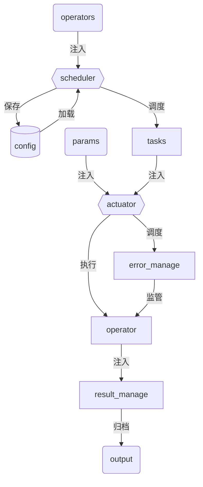

# 任务管理模块

[toc]

## 1. 概述

这个文档旨在提供任务管理相关的全面指南。它涵盖了任务管理的各个方面，包括任务的创建、调度、跟踪、错误代理、评估、反馈、归档等。目前已经实现任务创建、调度。其包括了团队成员有效沟通的最佳实践。

**设计(v0.1.3)如下：**



## 2. taskManage模块

taskManage模块负责任务的调度和管理，包括任务的参数配置、参数加载、算子实例化、算子调度等。

任务的管理比较复杂，未来规避动态导入的烦恼，TaskManager模块支持了字典和注册器两种方式进行算子注入。内部算子对象获取使用get接口获取，TaskManager模块算子入参可以参考字典的使用习惯，注册器做了相应的适配。TaskManager任务入参可以使用`dict`和`list[tuple]`两种方式进行注入。

### 2.1 列表注入任务案例

```python
>>> from codeUtils.scheduler.taskManage import TaskManager
>>> from codeUtils.scheduler.paramObject import IntParam
>>> class AreasFilter():
...     def __init__(self) -> None:
...         super().__init__()
...         self.areas = IntParam(10000)  # 参数会被代理检查
...         self.area_thresh = 0.0001  # 参数不会被代理
>>> tasks1 = [("filter1", "AreasFilter"), ("filter2", "AreasFilter")]
>>> taskManage1 = TaskManager(tasks=tasks, operators={"AreasFilter": AreasFilter})
```

### 2.2 字典注入任务案例

```python
>>> tasks2 = {"filter1": "AreasFilter", "filter2": "AreasFilter"}
>>> taskManage2 = TaskManager(tasks=tasks2, operators={"AreasFilter": AreasFilter})
```

### 2.3 注册器注入算子案例

```python
>>> from codeUtils.decorator.register import Register
>>> OPERATORS = Register("operators")
>>> @OPERATORS
... class AreasFilter():
...     def __init__(self) -> None:
...         super().__init__()
...         self.areas = IntParam(10000)  # 参数会被代理检查
...         self.area_thresh = 0.0001  # 参数不会被代理
>>> tasks3 = {"filter1": "AreasFilter", "filter2": "AreasFilter"}
>>> taskManage3 = TaskManager(tasks=tasks3, operators=Register)
```

### 2.4 算子参数保存

```python
>>> taskManage1.save_json_cfg("config.json")
```

### 2.5 算子参数加载

```python
>>> taskManage = TaskManager(operators={"AreasFilter": AreasFilter})
>>> taskManage.load_json_cfg("config.json", task_valid=False)
```

